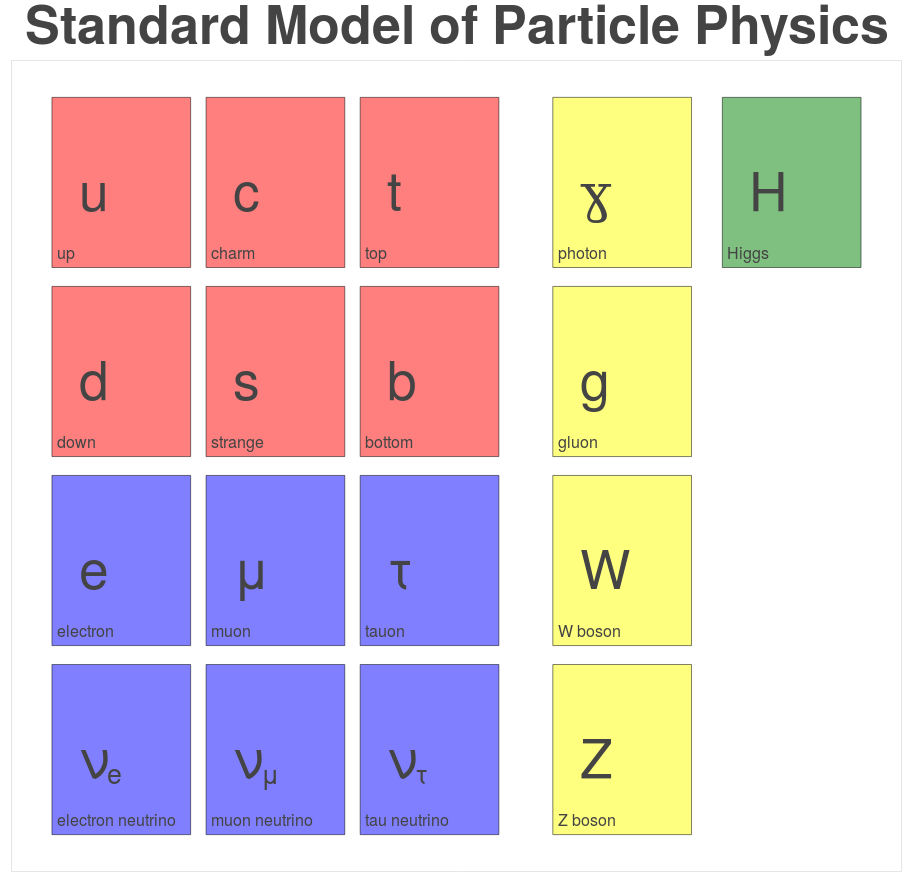
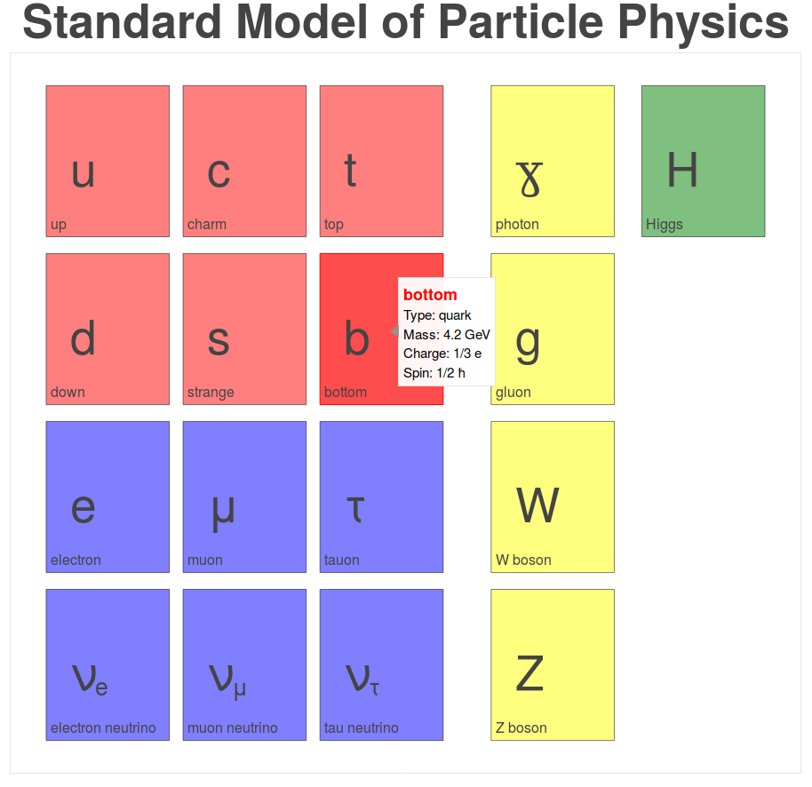

# An Interactive Standard Model of Particle Physics using Bokeh

This repository contains an example of an interactive visualization of the standard model of particle physics created with Bokeh.

The basic design is quite simple and minimalistic and only shows the names of the particles.
On hover, a small tooltip is shown containing more information such as the particle's mass, spin, and electrical charge.
Additionally, on click, each rectangle acts as a direct link to the Particle Data Group entry of the corresponding particle.

